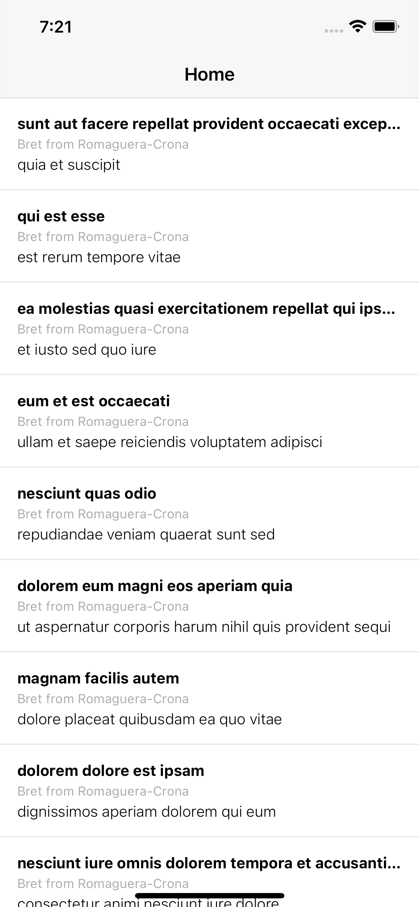
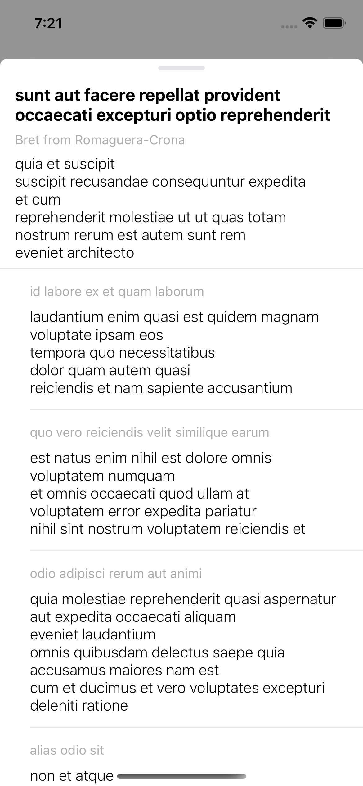
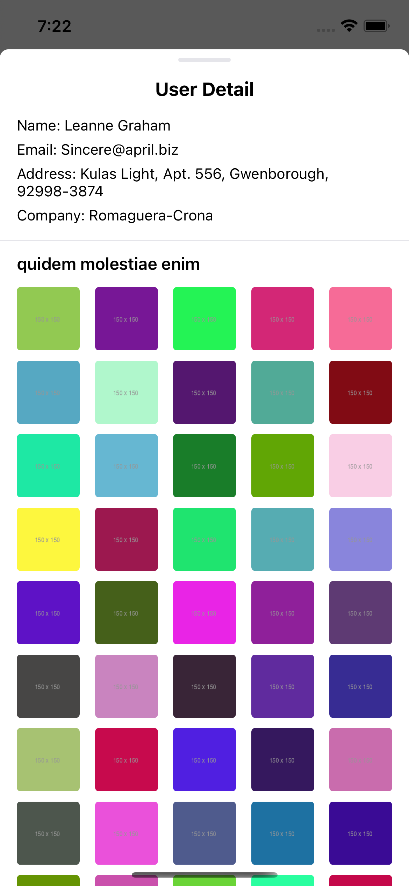
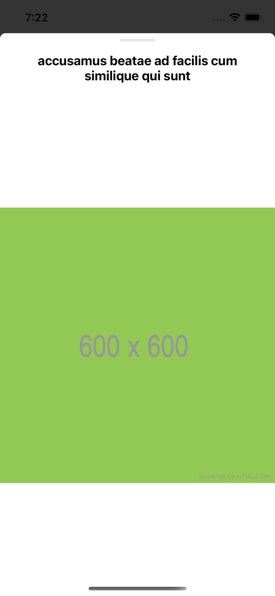

# Post News

|                        |                        |                        |                        |
|:----------------------:|:----------------------:|:----------------------:|:----------------------:|
|   |   |   |   |

This app is built with [Clean Swift VIP](https://clean-swift.com) architecture. The display list is built with UICollectionView. This collection view register PostCell as its cell which have the appropiate UI to show from view model, PostViewModel.

The View model is constructed from parsed response data that saved in coinList as Array of PostResponse.

We get the response from calling urlRequest from HomeInteractor -> HomeWorker. Worker will then make a request with URLSession to get the response.

If it returns an error, the next flow is present error through HomePresenter.
If it returns a valid data, then it will be parsed in HomePresenter.

Parsing process is using JSONDecoder, for post list response will be decoded with PostList, for user list response will be decoded with UserList, for comment list response will be decoded with CommentList, for album list response will be decoded with AlbumList and for photo list response will be decoded with PhotoList.

After parsing the parsed data will be presented in HomeViewController, the postList, userList, commentList, albumList and photoList will be updated accordingly and collectionView will be reloaded to refresh data.

Every process is based on protocol-delegate pattern.

## Features

* Show list of user post.
* Show user name and company on each post.
* Show post detail page.
* Show complete post and comment list on post detail page.
* Show photo detail page.
* Show title and full photo image on photo detail page.
* Show user detail page.
* Show user: name, email, address, company and album on user detail page.
* Pull to refresh on Home.
* Unit testing.

## Future Improvement

* Implement image caching.

## Tools

* Xcode 12.4
* Swift 5+
* iOS 14.4+

## Online Tools

* https://jsonformatter.org
* https://app.quicktype.io

## API

The app using API from: [jsonplaceholder](https://jsonplaceholder.typicode.com/)

## Built with

* [Swift](https://developer.apple.com/swift/) - Swift is a powerful and intuitive programming language for macOS, iOS, watchOS, tvOS and beyond.

<!-- ## Intention

This app is built for answering Mobile Application Test from [Kumparan](https://kumparan.com) at May 7th 2021. -->